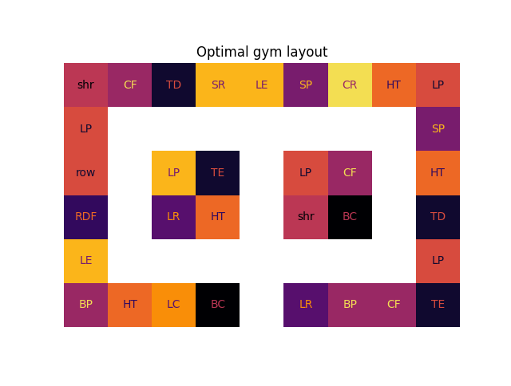
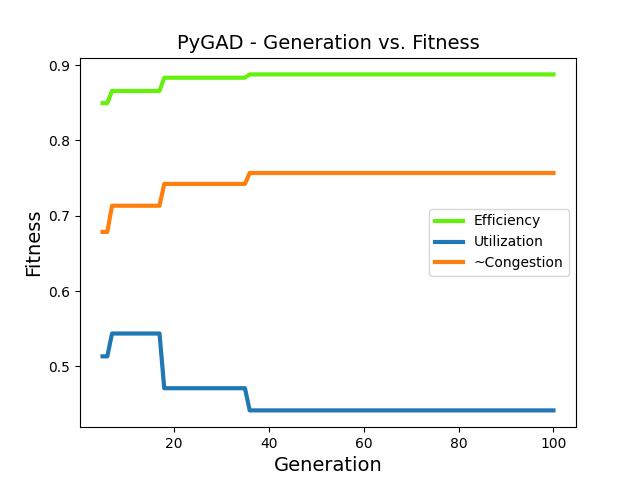
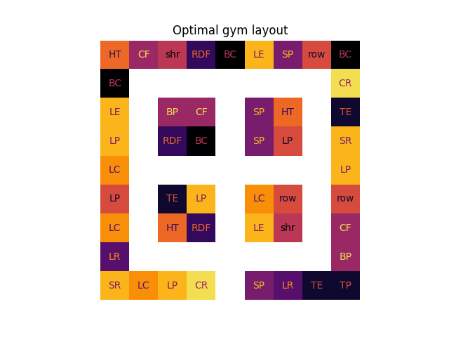
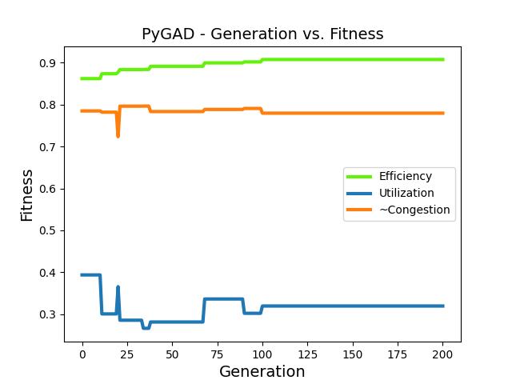

# gymulator

This repository explores the problem of *gym layout optimisation*.
A common occurrence in gyms at peak hours is over-crowding of popular equipment and lots of wandering around searching for a free machine.
Through simulating gym-goer behaviour, we aim to identify the most effective arrangement of exercise equipment to improve the flow, accessibility, and overall customer satisfaction.
Our goal is to offer practical insights for gym owners, managers, and designers seeking to optimise their facility layout for the benefit of their clients and business success.

We have obtained some preliminary results on small layout templates:

    
    
    <!-- 
     -->

## Project structure
Gym dynamics are modelled with Python's *Mesa* library for agent-based model simulation and visualization. 

The source files in the `/model/` directory contain:

- `gym_model.py`: a subclass of `mesa.Model`, which represents the gym environment.

- `visualisation.py`: functions for visualizing a gym environment.

- `gym_agent.py`: a subclass of `mesa.Agent`, which represents a gym-goer. It includes the behaviour of the gym-goer, such as choosing equipment and exercising.

- `playground.ipynb`: an interactive window for simulating a gym environment.

- `optimization.py`: an evolutionary gym layout optimisation procedure, implemented with the *PyGAD* library. Optimisation is constrained to layout templates, which are also defined here.

## Authors
- [Andrej Jočić](https://github.com/andrejjocic)
- [Matic Stare](https://github.com/maticstare)
- [Martin Starič](https://github.com/SpongeMartin)

